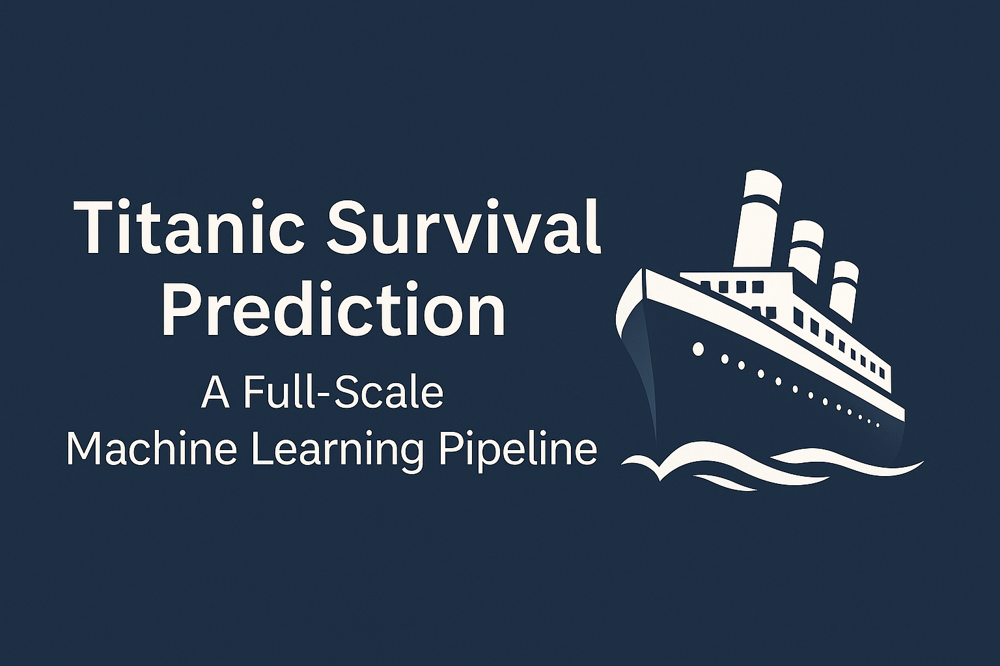

# 🚢 Titanic Survival Prediction — A Full-Scale Machine Learning Pipeline

This repository presents a **comprehensive machine learning project** built on the Titanic dataset from Kaggle. It goes beyond basic modeling by integrating deep learning, ensemble methods, and advanced feature engineering into a robust, end-to-end pipeline.

The project includes:

* A **custom FT-Transformer** implemented from scratch using PyTorch & PyTorch Lightning.
* A **LightGBM** gradient boosting model, tuned for optimal performance.
* A **Logistic Regression** baseline for comparison.
* A **majority-vote ensemble** of all three models.
* Full **hyperparameter tuning** using Optuna for every model.

> 🎯 **Goal**: Predict passenger survival using an interpretable and performance-driven machine learning workflow.

---

## 📌 Project Highlights

### 🤖 Model Implementations

Three distinct models were trained and compared:

1. **FT-Transformer**:
   * Built from the ground up using PyTorch and PyTorch Lightning.
   * Specifically adapted for tabular data with attention mechanisms.

2. **LightGBM**:
   * A highly efficient gradient boosting model popular in structured-data competitions.

3. **Logistic Regression**:
   * A fast, interpretable baseline for performance benchmarking.

### 🛠 Hyperparameter Tuning with Optuna

Each model underwent extensive tuning using the **Optuna** optimization framework to search for the best hyperparameters efficiently via:

* Bayesian optimization.
* Early stopping.
* Pruning of unpromising trials.

### 🔁 Ensemble Learning

A simple **majority** voting **ensemble** was used to combine the predictions from all three tuned models, providing better generalization and robustness.

### 🧩 End-to-End Pipeline

The entire process is encapsulated in a single script or notebook:

* Data loading and preprocessing
* Feature engineering
* Model training + hyperparameter optimization
* Evaluation and ensembling
* Submission file generation

---

## 🧠 Data Preprocessing and Feature Engineering

A robust preprocessing pipeline was developed to clean the data and create informative features. All steps were applied consistently across the training and test sets.

* **Feature Engineering**:
  * **Title**: Extracted titles from passenger names (e.g., 'Mr', 'Mrs', 'Master', 'Miss') and grouped rare titles into an 'Other' category. This captures social status and family structure.
  * **FamilySize**: Created by combining `SibSp` (siblings/spouses) and `Parch` (parents/children) to get the total size of a passenger's family aboard.
  * **IsAlone**: A binary feature derived from `FamilySize` to quickly identify solo travelers.
  * **Deck**: The deck level (e.g., 'A', 'B', 'C') was inferred from the first letter of the `Cabin` number. Missing cabin information was assigned its own 'U' (Unknown) category.
* **Handling** Missing **Values**:
  * **Age**: Missing age values were imputed using the median age, grouped by both passenger `Pclass` and the extracted `Title`. This provides a more accurate estimate than using a single global median.
  * **Fare**: The single missing fare value in the test set was imputed using the median fare of its corresponding `Pclass`.
  * **Embarked**: The two missing port of embarkation values were filled with the most frequent port ('S').

---

## 🤖 FT-Transformer from Scratch: Model Architecture

To explore state-of-the-art deep learning for tabular data, an FT-Transformer was implemented from scratch in PyTorch. The architecture follows the core concepts of the original paper:

1. **Feature Tokenizer**: This crucial first step converts the heterogeneous features into a sequence of uniform embedding vectors (tokens).
   * **Categorical Features**: Each categorical variable is passed through its own `nn.Embedding` layer to create a learned, dense vector representation.
   * **Numerical Features**: Each numerical feature is passed through its own individual `nn.Linear` layer to project it into the same embedding dimension as the categorical tokens.
   * **CLS Token**: A learnable `[CLS]` (classification) token is prepended to the sequence. This token is designed to act as an aggregate representation of the entire row of features after being processed by the encoder.

2. **Transformer Encoder**: The sequence of tokens is then passed through a stack of standard Transformer blocks. Each block consists of:
   * A Multi-Head Self-Attention layer, allowing tokens to weigh the importance of other tokens in the sequence.
   * A Feed-Forward Network.
   * Residual ("skip") connections and Layer Normalization to ensure stable training.

3. **Prediction Head**: After processing by the Transformer Encoder, the final output vector corresponding to the `[CLS]` token is isolated. This single vector, which now contains contextualized information from all other features, is passed to a small multi-layer perceptron (MLP) head to produce the final survival prediction.

---

## 🏁 Results on Kaggle Leaderboard

| Model | Accuracy |
 | ----- | ----- |
| **FT-Transformer (Tuned)** | **0.77033** |
| LightGBM (Tuned) | 0.76794 |
| Logistic Regression (Tuned) | 0.76794 |
| **Ensemble** (Majority **Vote)** | 0.76315 |


> ✅ The **FT-Transformer** outperformed all others, demonstrating that even complex deep learning models can shine with proper architecture and tuning — even on small tabular datasets.

---

## 🧪 How to Run the Project

### 1. Clone the Repository

``` bash
git clone [https://github.com/your-username/titanic-ml-ft-transformer.git](https://github.com/your-username/titanic-ml-ft-transformer.git)
cd titanic-ml-ft-transformer
```

### 2. Install Dependencies

Create a virtual environment (optional but recommended), then:

``` bash
pip install -r requirements.txt
```

### 3. Prepare the Data

Download `train.csv` and `test.csv` from the [Kaggle Titanic dataset](https://www.kaggle.com/c/titanic/data) and place them in the project root directory.

### 4. Run the Full Pipeline

Execute the main Python script to run:

* Feature engineering
* Hyperparameter tuning
* Model training
* Submission generation

``` bash
python main.py
```

This will produce the following output files:

* `submission_ft_transformer_tuned.csv`
* `submission_lgbm_tuned.csv`
* `submission_logreg_tuned.csv`
* `ensemble_submission_tuned.csv`

---

## 🛠 Tech Stack

| Domain | Tools / Libraries |
 | ----- | ----- |
| Language | Python 3.10+ |
| Data | Pandas, NumPy, Scikit-learn |
| Deep Learning | PyTorch, PyTorch Lightning, TorchMetrics |
| Tree-Based Models | LightGBM |
| Optimization | Optuna |
| Visualizations | Matplotlib, Seaborn (optional for analysis) |

---

## 📂 Repository Structure (Example)

``` bash

titanic-ml-ft-transformer/
│
├── assets/               
├── data/                 # Contains train.csv and test.csv
├── logs/                 # Contains the best hyperparameters json file found by optuna 
├── src/                  # Modular scripts
├── checkpoints/          # Contains the model checkpoints 
├── notebooks/            # Jupyter Notebook for the project
├── requirements.txt
└── README.md

```

---

## 📈 Future Improvements (TODOs)

* Add cross-validation support for final evaluation.
* Visualize attention maps from FT-Transformer.
* Experiment with stacking and weighted ensembling.
* Create a Streamlit or Gradio app for deployment.

---

## 📣 Acknowledgments

* **Kaggle** for the Titanic dataset.
* **"Revisiting Deep Learning Models for Tabular Data"** paper for FT-Transformer inspiration.
* **Optuna** for seamless hyperparameter optimization.
